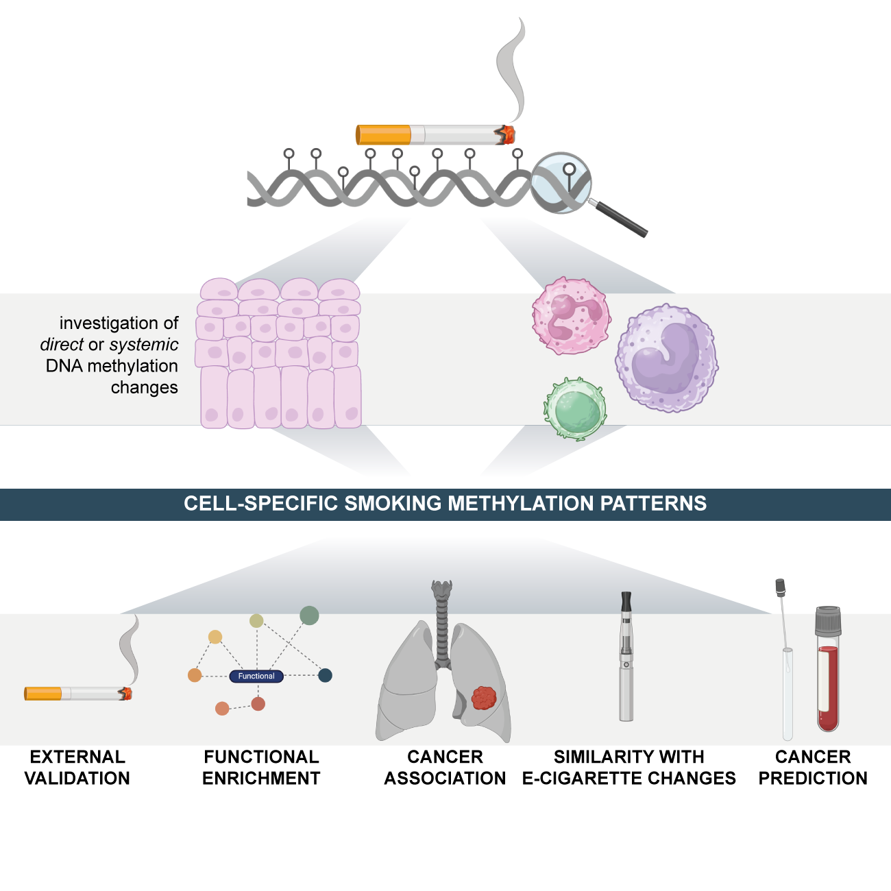
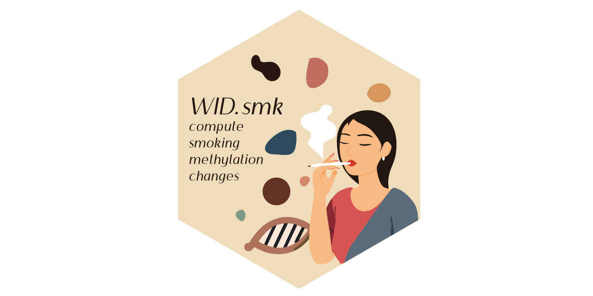

# WID SMK code repository

## About

This code accompanies the manuscript '**Cigarette smoking and e-cigarette use induce shared DNA methylation changes linked to carcinogenesis**', by Herzog *et al.* (2024) and provides the necessary scripts to perform analyses and reproduce figures and display items. The link to the GitHub repository can be found [here](https://github.com/chiaraherzog/WID_SMK_code).

## Abstract

Tobacco use is a major modifiable risk factor for adverse health outcomes, including cancer, and elicits profound epigenetic changes thought to be associated with long-term cancer risk. While electronic cigarettes (e-cigarettes) have been advocated as harm reduction alternatives to tobacco products, recent studies have revealed potential detrimental effects, highlighting the urgent need for further research into the molecular and health impacts of e-cigarettes. Here, we applied computational deconvolution methods to dissect the cell- and tissue-specific epigenetic effects of tobacco or e-cigarette use on DNA methylation (DNAme) in over 3,500 buccal/saliva, cervical, or blood samples, spanning epithelial and immune cells at directly and indirectly exposed sites. The 535 identified smoking-related DNAme loci (CpGs) clustered into four functional groups, including detoxification or growth signaling, based on cell type and anatomical site. Loci hypermethylated in buccal epithelial cells of smokers associated with NOTCH1/RUNX3/growth factor receptor signaling also exhibited elevated methylation in cancer tissue and progressing lung carcinoma in situ lesions, and hypermethylation of these sites predicted lung cancer development in buccal samples collected from smokers up to 22 years prior to diagnosis, suggesting a potential role in driving carcinogenesis. Alarmingly, these CpGs were also hypermethylated in e-cigarette users with a limited smoking history. This study sheds light on the cell type-specific changes to the epigenetic landscape induced by smoking-related products.

{width=60%}

## Guide to contents and structure

The full analysis can be run with the script file `run-analysis.sh`. It calls separate script files contained in the folders.

* `0-source`:
	+ This directory contains datasets and information required (e.g., lists of CpGs from previous studies) for scripts used in this repository.
	+ This directory also contains functions that are used later in the manuscript, e.g., for plotting.
* `1-analysis-pipeline`:
	+ This directory contains, in ordered number, the main files to reproduce the analyses and major computations. Note: scripts may be nested in subfolders (1-delta-beta) or provided as singular R files. 
	+ Outputs of scripts may be included in corresponding subfolders. For instance, the output of `1-analysis-pipeline/2-define-subsets.R` will be placed in `1-analysis-pipeline/2-output/`. Outputs will be called later for computations and/or plotting.
* `2-markdown`: 
	+ This directory contains code to reproduce the main display items (`WID_SMK.Rmd`) or Supplementary Figures (`Supplementary_WID_SMK.Rmd`).

## Data notes

### Raw data

Please note that raw methylation data are deposited in the European Genome-Phenome Archive, controlled by the NSHD or the University of Bristol, and available only under controlled access that must be requested separately. Details are provided in the corresponding manuscript(s). Any scripts relying on raw methylation data have been commented out from `run-analysis.sh` and outputs are contained in the repository for plotting. If raw data access has been granted, you can update your directory links to the raw data and run everything.

### Summary data

Summary data, or data for plotting are provided in outputs of scripts.

## Apply smoking indices to your dataset

<table border="0">
 <tr>
    <td>To compute the new smoking indices in your dataset, please take a look at the [WID.smk](https://github.com/chiaraherzog/WID.smk) package.</td>
    <td></td>
 </tr>
</table>

## Further information

If you have any questions, please reach out: [chiaraherzog.github.io](https://chiaraherzog.github.io/).
